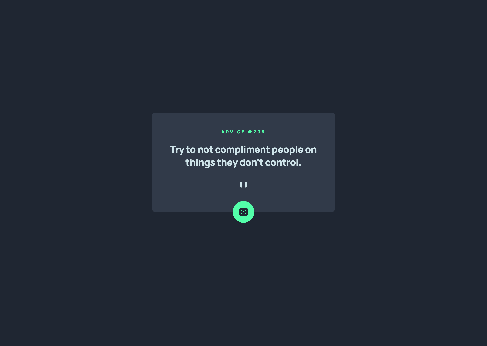

# Frontend Mentor - Advice generator app solution

This is a solution to the [Advice generator app challenge on Frontend Mentor](https://www.frontendmentor.io/challenges/advice-generator-app-QdUG-13db). Frontend Mentor challenges help you improve your coding skills by building realistic projects.

## Table of contents

- [Overview](#overview)
  - [The challenge](#the-challenge)
  - [Screenshot](#screenshot)
  - [Links](#links)
- [My process](#my-process)
  - [Built with](#built-with)
  - [What I learned](#what-i-learned)
  - [Continued development](#continued-development)
  - [Useful resources](#useful-resources)
- [Author](#author)
- [Acknowledgments](#acknowledgments)

## Overview

### The challenge

Users should be able to:

- View the optimal layout for the app depending on their device's screen size
- See hover states for all interactive elements on the page
- Generate a new piece of advice by clicking the dice icon

### Screenshot



### Links

- Solution URL: [Add solution URL here](https://github.com/pronoia9/nifty-noggin)
- Live Site URL: [Add live site URL here](https://nifty-noggin.vercel.app/)

## My process

### Built with

- [React](https://reactjs.org/) - JS library
- [Axios](https://axios-http.com) - Promise-based HTTP library
- [Styled Components](https://styled-components.com) - React-specific CSS-in-JS library

### What I learned

This was the first time I used Axios when I first made this project. Redoing it (or updating it) this is the first time I used styled-components on my own. Funny enough, the way I've used axios is different the second time.

<!-- Use this section to recap over some of your major learnings while working through this project. Writing these out and providing code samples of areas you want to highlight is a great way to reinforce your own knowledge. -->

```js
// v1
try {
  const response = await axios.get('https://api.adviceslip.com/advice');
  setCard(response.data.slip);
} catch (error) {
  console.error(error);
}

// v2
axios
  .get('https://api.adviceslip.com/advice')
  .then((response) => {
    const data = response.data.slip;
    advice?.id !== data.id ? setAdvice(data) : fetchAdvice();
  })
  .catch((error) => {
    console.error(error);
  });
```

<!-- If you want more help with writing markdown, we'd recommend checking out [The Markdown Guide](https://www.markdownguide.org/) to learn more. -->

### Continued development

~~I plan on furthering this mini project by adding animations such as animate.css and typed.js.~~
I added animations when I decided to redo this app. I'm not exactly pleased by them, but I can always change them later.

### Useful resources

- [Axios](https://www.npmjs.com/package/axios) - This helped me for faster API calls. I really liked this package ~~and will use it going forward~~ and have been using it ever since I discovered it.
- [Styled Components](https://styled-components.com) - I've discovered this library, or rather used it for the first time, pretty recently and at first didn't liked it cause it felt like my components were cluttered a lot, but now I like it quite a lot. Will be using it from now on.

## Author

- Website - [Nifty Noggin](https://nifty-noggin.vercel.app/)
- LinkedIn - [jayansin](https://www.linkedin.com/in/jayansin/)

## Acknowledgments

I'd like to thank the AI assistant [ChatGPT](https://chat.openai.com/) for providing the creative and unique name "Nifty Noggin" for this project. Their suggestions were instrumental in coming up with a catchy and memorable name that captures the essence of this application.

**Note: Delete this note and edit this section's content as necessary. If you completed this challenge by yourself, feel free to delete this section entirely.**
